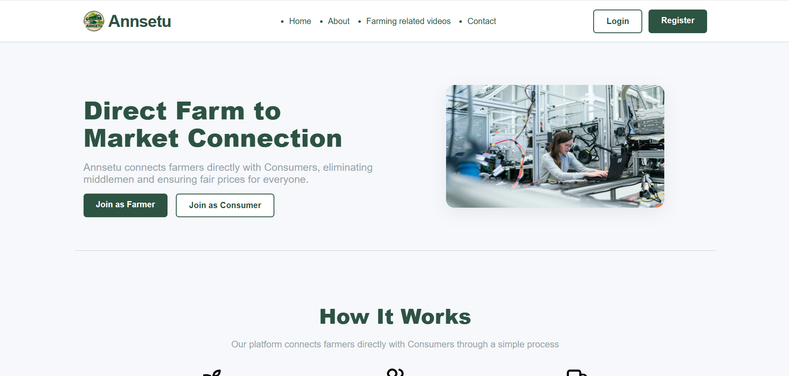

# 🌾 AnnSetu

AnnSetu is a platform designed to **connect farmers directly with buyers**, eliminating intermediaries and ensuring **fair, transparent, and profitable transactions** in the agricultural sector.

🚜 Empower Farmers  
🤝 Enable Direct Trade  

---

## 💡 Motivation

AnnSetu was conceptualized to address one of the most pressing issues in agriculture — **middlemen reducing farmers' profits** and **lack of direct access to markets**.

AnnSetu aims to become a digital bridge between producers and consumers, reshaping how agricultural goods are traded.

---

## 🔧 Features

- 📍 **Farmer and Buyer Registration**
- 🛒 **Direct Listings of Produce**
- 💬 **Negotiation & Communication Tools**
- 💰 **Transparent Pricing**
- 📊 **Real-Time Demand & Supply Insights**
- 📦 **Order Management & Logistics Coordination**

---

## 🛠️ Tech Stack

| Layer        | Technologies        |
|--------------|---------------------|
| **Frontend** | React / HTML / CSS  |

---
